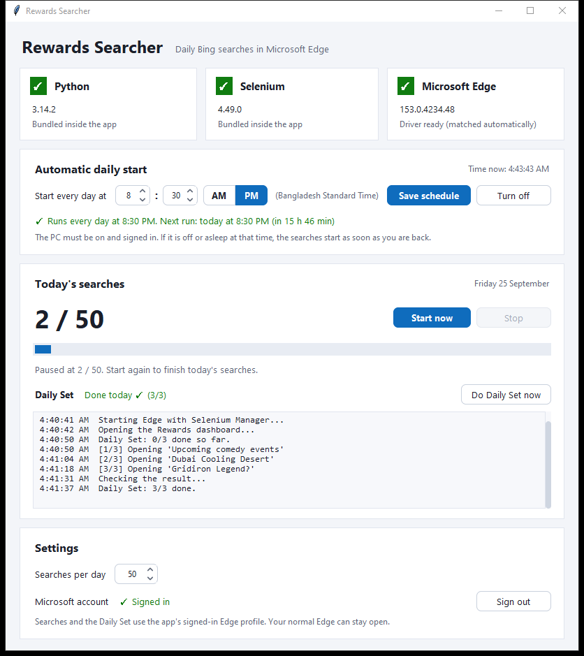

# Microsoft Edge Automation: Rewards Searcher

A Windows app that runs your 50 daily Bing searches in Microsoft Edge. It can start by itself every day at a time you choose.



> **Heads-up:** automating searches is against the Microsoft Rewards terms. Microsoft can suspend accounts that do it. Use at your own risk.

## Features

- **One file, nothing to install:** Python and Selenium are packed inside `RewardsSearcher.exe`.
- **Status checks:** boxes show whether Python, Selenium and Microsoft Edge are ready.
- **Daily automatic start:** pick a time in 12-hour format. It runs in your PC's own time zone, including daylight saving.
- **Live progress:** an *x / 50* counter and a log. Interrupted runs continue where they stopped, and the count resets at midnight.
- **Edge driver handled for you:** the matching driver is downloaded from Microsoft on each PC. No driver is shipped with the app.
- **Sign in once:** the app has its own Edge profile. Searches then count for your Microsoft account, and your normal Edge can stay open.
- **Daily Set in one click:** opens today's 3 Daily Set activities, to keep your streak going.

## Download and run

You need:
- Windows 10 or 11
- Microsoft Edge
- Internet

Steps:
1. Download the zip from the [**latest release**](https://github.com/jayed2003/microsoft-edge-automation/releases/latest), or [build it yourself](#build-it-yourself).
2. Right-click the zip → **Extract All**, then double-click `RewardsSearcher.exe`.
   - If Windows says **"Windows protected your PC"**, click **More info → Run anyway**. It says this for any app that isn't from a big publisher.
   - Some antivirus programs flag packed Python apps. If yours blocks the file, allow it.
3. Wait for the **Python**, **Selenium** and **Microsoft Edge** boxes to turn green ✓. The first time, the Edge box downloads the driver that matches your Edge.
4. [Sign in](#sign-in-to-your-microsoft-account) to your Microsoft account.
5. Click **Start now**, or set up the daily start below.

## Using it

### Start automatically every day

1. Under **Automatic daily start**, pick the hour, minutes and **AM | PM**.
2. Click **Save schedule**. You only do this once.

Good to know:
- **Time zone:** your PC's time zone is shown next to the time field. If it's wrong, fix it in **Settings → Time & Language → Date & time**.
- **At the chosen time:** the app opens, Edge opens, and the searches run. The window closes 10 seconds after they finish.
- **App already open:** the open window starts the searches itself.
- **PC off or asleep:** the searches start as soon as you're back. The PC has to be on and you have to be signed in to Windows.
- **On a laptop:** it also runs on battery.
- **The downloaded exe:** you can move or delete it after saving. The app installs its own copy in `%LOCALAPPDATA%\RewardsSearcher\`, and the schedule uses that copy.
- **Stopping it:** click **Turn off**.

### Sign in to your Microsoft account

The app uses its own Edge profile, separate from your normal Edge. Sign in to it once:
1. In **Settings → Microsoft account**, click **Sign in…**. An Edge window opens on the Rewards page.
2. Sign in there. Tick "Stay signed in" if Microsoft asks.
3. When you see your Rewards dashboard, close that Edge window or click **I'm signed in**.

After a few seconds the app shows **✓ Signed in**. From then on, searches and the Daily Set use this signed-in profile, and your normal Edge can stay open while they run. **Sign out** deletes the app's profile.

If you don't sign in, the searches run in a fresh Edge profile. They only count for your account if Windows itself is signed in with the same Microsoft account.

You can also change **Searches per day** in **Settings** (default 50).

### Daily Set (streak)

Rewards gives streak bonuses for completing the **Daily Set**, three activities on the dashboard, every day. Once you're signed in, click **Do Daily Set now** in the **Today's searches** card.

The app opens the dashboard, clicks each Daily Set activity, and closes the tabs. Opening an activity is enough to earn its points; the quizzes inside don't have to be finished. Afterwards it reads the dashboard's own counter, and the row shows **Done today ✓ (3/3)**. Clicking again on a finished day just reports that it's done.

The Daily Set only runs when you click the button. The daily schedule does the searches only.

> The Daily Set depends on the layout of the Rewards dashboard, which Microsoft changes from time to time, so the app may need an update after a redesign. It currently needs the dashboard in English.

### Problems

| What you see | What to do |
|---|---|
| Edge box is ✗ *"Driver download failed"* | Connect to the internet and reopen the app. A driver download is needed the first time and after each Edge update. |
| Edge box is ✗ *"Not found"* | Install Microsoft Edge from [microsoft.com/edge](https://www.microsoft.com/edge). |
| *"Edge was closed, so the searches stopped at x/50"* | The Edge window was closed during the run. Click **Start now** to continue. |
| **Do Daily Set now** is greyed out | Sign in first: **Settings → Microsoft account → Sign in…**. |
| *"Couldn't find the Daily set on the Rewards dashboard"* | Microsoft changed the dashboard, so the app needs an update. Do the Daily Set by hand for now. |
| Daily Set shows *"2/3 counted today"* | Click **Do Daily Set now** again. If it stays short, finish the missing activity on the dashboard by hand. |
| *"Close the Edge window you signed in with"* | The sign-in Edge window is still open. Close it and try again. |
| *"The schedule points to a missing file"* | Click **Save schedule** again. |
| Anything else, or a scheduled run didn't happen | Open `%LOCALAPPDATA%\RewardsSearcher\log.txt`. Every run is logged there, including scheduled ones. |

### Uninstall

1. Click **Turn off** in the app.
2. Delete the folder `%LOCALAPPDATA%\RewardsSearcher`.

## Build it yourself

You need Python 3.12 or newer on Windows.

```bat
git clone https://github.com/jayed2003/microsoft-edge-automation.git
cd microsoft-edge-automation
build_exe.bat
```

`build_exe.bat` does three things:
1. Creates a local `.venv`.
2. Installs Selenium and PyInstaller into it.
3. Builds a single self-contained `dist\RewardsSearcher.exe`. That is the only file you need to share.

To run from source instead:

```bat
pip install selenium
python app.py
```

`python script.py` runs the 50 searches without the window.

### Project files

| File | Purpose |
|---|---|
| `app.py` | The window and entry point. The scheduled task starts it with `--autorun`. |
| `script.py` | The search engine: starts Edge through Selenium and runs the Bing searches. It also manages the app's Edge profile and the sign-in check. |
| `dailyset.py` | Opens today's Daily Set activities on the Rewards dashboard |
| `scheduler.py` | Creates, reads and removes the Windows Task Scheduler task |
| `storage.py` | Settings, today's progress and the log |
| `widgets.py` | The rounded boxes, buttons, AM/PM toggle and on/off switch, drawn in code with no extra libraries |
| `build_exe.bat` | Builds `dist\RewardsSearcher.exe` with PyInstaller |

### How it works

- **Edge driver:** Selenium Manager, which is part of Selenium, downloads the driver matching the installed Edge from Microsoft. It caches the driver in `%USERPROFILE%\.cache\selenium`, and downloads a new one only after Edge updates.
- **Sign-in:** **Sign in…** opens a normal, non-automated Edge on the app's own profile folder, where the user signs in. The app never sees the password.
  - Selenium then reuses that profile with `--user-data-dir`. It's a separate folder from the user's Edge, so both can run at once.
  - The sign-in check opens `rewards.bing.com/dashboard` in headless Edge. Signed-out visitors are redirected to `/about`.
- **Daily Set:** `dailyset.py` finds the cards under the dashboard's "Daily set" heading and clicks each one, since opening a card is what earns its points. It closes each tab the card opens, then reads the "Daily Set · Activity: x/3" counter to confirm.
- **Schedule:** a per-user task named `RewardsSearcher` is registered with `schtasks /Create /XML`, so no admin rights are needed. Its settings:
  - Daily trigger in local time.
  - Start when available: missed runs happen later.
  - Runs on battery.
  - Runs only while the user is logged on, because Edge must be visible.
  - The action is `%LOCALAPPDATA%\RewardsSearcher\RewardsSearcher.exe --autorun`.
- **One copy at a time:** a named mutex keeps a second copy from starting. When the scheduled copy finds the app already open, it signals the open window through a named event and exits, and the open window starts the searches.
- **Data:** everything is stored in `%LOCALAPPDATA%\RewardsSearcher\`:
  - `settings.json`: time, searches per day, and whether the app is signed in
  - `progress.json`: today's search count
  - `dailyset.json`: today's Daily Set result
  - `EdgeProfile\`: the app's own signed-in Edge profile
  - `log.txt`: run history
  - `RewardsSearcher.exe`: the installed copy the schedule runs
